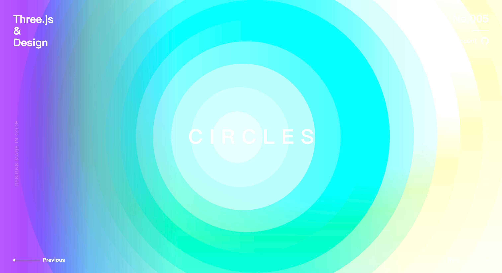

# Three.js & Design

## [No.001](./src/views/no001/index.ts)

参考：[Basic practice of three.js](https://codepen.io/tksiiii/pen/jwdvGG)

## [No.002](./src/views/no002/index.ts)

参考：[Daily CSS Design - Day 224](https://dailycssdesign.com/224/)

## [No.003](./src/views/no003/index.ts)（待优化）

参考：[Daily CSS Design - Day 371](https://dailycssdesign.com/371/)

> [GLSL-Noise](https://gist.github.com/patriciogonzalezvivo/670c22f3966e662d2f83)

## [No.004](./src/views/no004/index.ts)

参考：[Daily CSS Design - Day 334](https://dailycssdesign.com/334/)

## [No.005](./src/views/no005/index.ts)

参考：[Daily CSS Design - Day 50](https://dailycssdesign.com/50/)

## [No.006](./src/views/no006/index.ts)

参考：[Daily CSS Design - Day 51](https://dailycssdesign.com/51/)

## TODO:
- https://dailycssdesign.com/161/
- https://dailycssdesign.com/144/
- https://dailycssdesign.com/190/
- https://dailycssdesign.com/194/

## 问题:

1. 升级 three.js (> 0.151) 版本会导致颜色偏暗
   - 暂时没有好的解决办法，~~部分案例临时使用 `new THREE.Color(0xFF79B4).convertLinearToSRGB()` 处理（有些案例不生效）~~ 回退到 0.151 版本
   - 参考链接：[官方社区讨论帖子](https://discourse.threejs.org/t/updates-to-color-management-in-three-js-r152/50791/66)