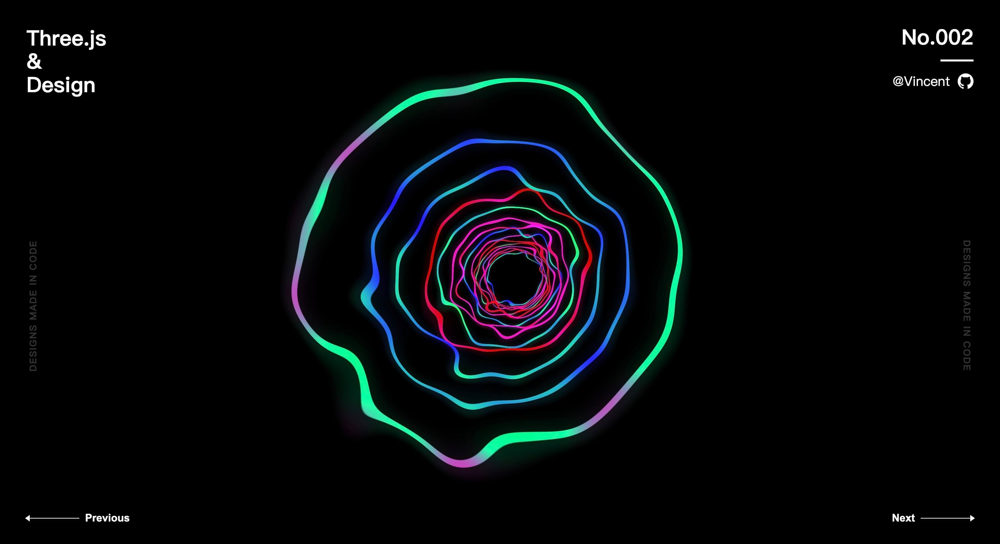

# Three.js & Design

## [No.001](./src/views/no001/index.ts)

参考：[Basic practice of three.js](https://codepen.io/tksiiii/pen/jwdvGG)

> 蠕动球体

## [No.002](./src/views/no002/index.ts)

参考：[Daily CSS Design - Day 224](https://dailycssdesign.com/224/)

> 彩色黑洞

## TODO:
- https://dailycssdesign.com/144/
- https://dailycssdesign.com/190/
- https://dailycssdesign.com/194/
- https://dailycssdesign.com/334/
- https://dailycssdesign.com/347/