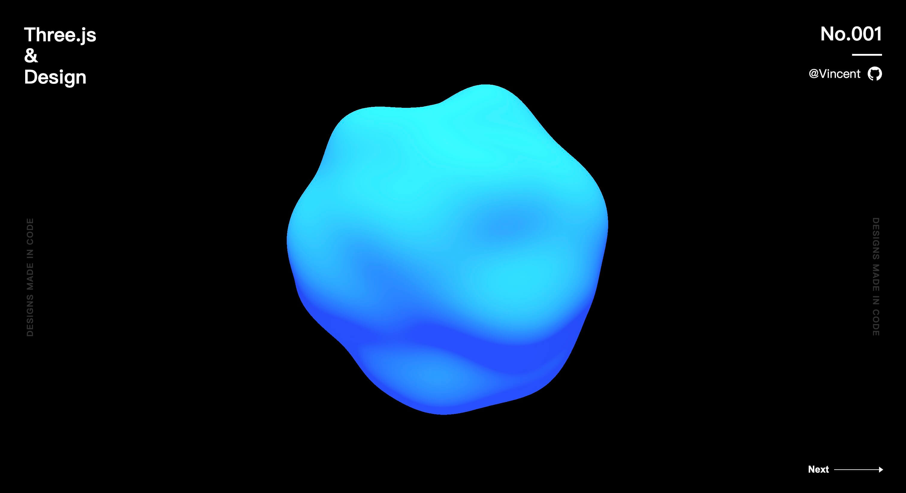
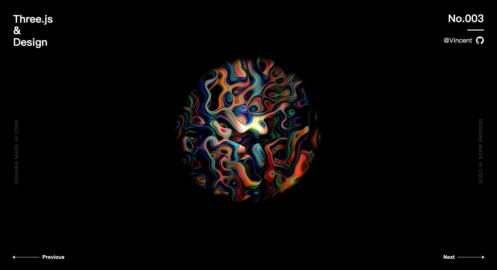

# Three.js & Design

## [No.001](./src/views/no001/index.ts)

参考：[Basic practice of three.js](https://codepen.io/tksiiii/pen/jwdvGG)

## [No.002](./src/views/no002/index.ts)

参考：[Daily CSS Design - Day 224](https://dailycssdesign.com/224/)

## [No.003](./src/views/no003/index.ts)

参考：[Daily CSS Design - Day 371](https://dailycssdesign.com/371/)

> [GLSL-Noise](https://gist.github.com/patriciogonzalezvivo/670c22f3966e662d2f83)

## [No.004](./src/views/no004/index.ts)

参考：[Daily CSS Design - Day 334](https://dailycssdesign.com/334/)

## TODO:
- https://dailycssdesign.com/51/
- https://dailycssdesign.com/161/
- https://dailycssdesign.com/144/
- https://dailycssdesign.com/190/
- https://dailycssdesign.com/194/
- https://dailycssdesign.com/347/